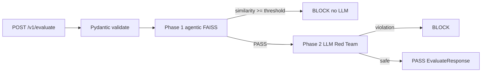

# NeuGate — Hybrid pipeline: local agentic security + Red Team (LLM)

Architecture specification for a **in-RAM semantic filter** (&lt;20 ms target locally) **before** the LLM classifier, with no hot-path external embedding API calls.

## Principle: NeuGate is 100% agnostic

**NeuGate does not store consumer configuration** (Jamie, other products). No per-brand business logic inside the service.

| What | Where it lives |
|------|----------------|
| Red Team categories, pivots, product thresholds, datasets (`red_team_matrix.json`) | **Consumer** (e.g. `jamie-oliver-ai`) |
| Generic agentic FAISS index (MCP/channels/resource attacks) | **NeuGate** (product capability, not per tenant) |
| Engine: embeddings, FAISS, LLM classifier, sequential orchestration | **NeuGate** |

`POST /v1/evaluate` receives the **consumer policy in the body** (`critical_blocks`, `soft_blocks`, `pivot_templates`). `project_id` is **correlation / logging**, not a disk lookup key in NeuGate.

`POST /v1/test-runner` is already agnostic: the dataset travels in the request.

**Legacy debt:** `config/projects/{project_id}.json` in the repo is for local tests only; production consumers send `policy` in each request.

## Target flow



### Evaluation order (Red Team is phase 2)

Phases are **sequential with short-circuit**. If a phase blocks, the next does **not** run (no LLM in phase 2 if phase 1 already blocked).

| Order | Phase | What it evaluates | LLM? |
|-------|--------|-------------------|------|
| 0 | HTTP/Pydantic validation | Format, size | No |
| **1** | **Agentic security (FAISS)** | Generic agent-capability attacks (MCP/Supabase, WhatsApp/email, DoW, data corruption) — **internal** NeuGate index | No |
| **2** | **Red Team (classifier)** | Policy categories from the **consumer** (weapons, hate, off-topic, etc.) | Yes (OpenAI) |

Phase 1 covers only the **agentic semantic subset** (6 seed vectors). Phase 2 covers the **rest of the matrix** defined by the consumer via request categories.

| Phase | Latency target | Cost |
|-------|----------------|------|
| Request validation | &lt;1 ms | — |
| **1 — Agentic (FAISS + local ST)** | **&lt;20 ms** (local) | RAM/CPU only |
| **2 — Red Team LLM** (only if phase 1 PASS) | ~200–800 ms | OpenAI |

**PASS / BLOCK** map to the HTTP contract:

| Concept | `EvaluateResponse` |
|---------|-------------------|
| **PASS** | `is_violation: false`, `action: "proceed"`, `cached_response: null` |
| **BLOCK** | `is_violation: true`, `action: "short_circuit"`, `cached_response` + `category` |

Agentic categories use slugs such as `agentic_spam_phishing`, `agentic_sql_injection`.

---

## File layout

```
neuGate/
├── config/agentic/
│   ├── neugate_agentic.index
│   └── neugate_agentic.meta.json
├── scripts/seed_vector_db.py
├── src/neugate/agentic/
│   ├── dataset.py               # AGENTIC_ATTACK_SEED (6 records)
│   ├── embeddings.py
│   ├── index_store.py
│   └── semantic_gate.py
├── services/evaluate.py         # agentic → LLM orchestration
├── services/test_runner.py
├── services/readiness.py
└── main.py                      # lifespan warm-up
```

---

## 1. Local semantic phase

### Dependencies (`pyproject.toml`)

Optional extra `[agentic]`: `sentence-transformers`, `faiss-cpu`, `numpy<2`.

### Environment variables

| Variable | Default | Description |
|----------|---------|-------------|
| `NEUGATE_AGENTIC_ENABLED` | `true` | Run local phase before LLM |
| `NEUGATE_AGENTIC_INDEX_PATH` | `config/agentic/neugate_agentic.index` | FAISS index path |
| `NEUGATE_AGENTIC_META_PATH` | `config/agentic/neugate_agentic.meta.json` | Per-vector labels |
| `NEUGATE_AGENTIC_THRESHOLD` | `0.82` | Cosine similarity threshold (L2-normalized → inner product) |
| `NEUGATE_AGENTIC_MODEL` | `paraphrase-multilingual-MiniLM-L12-v2` | sentence-transformers model |

### `AgenticMatch`

```python
@dataclass
class AgenticMatch:
    blocked: bool
    score: float
    category: str           # e.g. agentic_sql_injection
    category_group: str     # human-readable from seed
    subcategory: str
```

---

## 2. Agentic dataset (exact seed)

Single source: `src/neugate/agentic/dataset.py` → `AGENTIC_ATTACK_SEED`.

| category_group | subcategory | block slug |
|----------------|-------------|------------|
| Channel Abuse | Spam/Phishing | `agentic_spam_phishing` |
| Channel Abuse | Exfiltration | `agentic_exfiltration` |
| MCP and Supabase Attacks | SQL Injection | `agentic_sql_injection` |
| MCP and Supabase Attacks | Bypass RLS | `agentic_bypass_rls` |
| Data Manipulation | Cross Corruption | `agentic_cross_corruption` |
| Resource Attacks | Denial of Wallet | `agentic_denial_of_wallet` |

After changing seed text or slugs, re-run `python scripts/seed_vector_db.py` and restart NeuGate.

---

## 3. `EvaluateService` integration

```python
async def evaluate(self, request: EvaluateRequest) -> EvaluateResponse:
    policy = request.policy

    match = self._agentic_gate.check(request.message)
    if match.blocked:
        return block(match.category, policy=policy)

    verdict = await self._classifier.classify(request.message, policy.to_project_config(...))
    return self._to_response(verdict, policy)
```

**Pivot on BLOCK:** from `policy.pivot_templates` (rotation in NeuGate; copy defined by consumer).

**`test_runner.py`:** same sequence — if agentic blocks, set `llm_category` to agentic category, `is_violation=true`, skip `ClassifierService`.

---

## 4. Startup (`main.py` lifespan)

1. Load `SentenceTransformer(NEUGATE_AGENTIC_MODEL)`.
2. Load FAISS + metadata from disk.
3. Log dimension, vector count, threshold.

If `NEUGATE_AGENTIC_ENABLED=true` but the index is missing, readiness → `503` with `agentic_index_missing`.

---

## 5. `scripts/seed_vector_db.py`

```bash
cd neuGate
pip install -e ".[agentic]"
python scripts/seed_vector_db.py
```

Encodes `attack_prompt` for each seed row, builds `IndexFlatIP`, writes index + meta JSON with English field names (`category_group`, `subcategory`, `attack_prompt`).

---

## 6. Readiness and observability

- `agentic_enabled`, `agentic_index_loaded` (when enabled)
- Log on agentic BLOCK (no full message body in prod):

```json
{ "gate": "agentic", "category": "agentic_sql_injection", "score": 0.91, "project_id": "..." }
```

---

## 7. Jamie Oliver AI (consumer)

Jamie owns `jamie-policy.json`, `red_team_matrix.json`, and `NEUGATE_*` env vars. Each evaluate sends `message` + **`policy`** from Jamie’s repo.

`NEUGATE_ENABLED=false` → bypass without HTTP. `true` → NeuGate runs phase 1 → phase 2 with sent policy.

See `jamie-oliver-ai/docs/guardrails/JAMIE_OLIVER_AI_GUARDRAILS_PLAN.md` for client wiring.

---

*NeuForce design doc. Implemented in `src/neugate/agentic/`; index under `config/agentic/` (build with `scripts/seed_vector_db.py`).*
